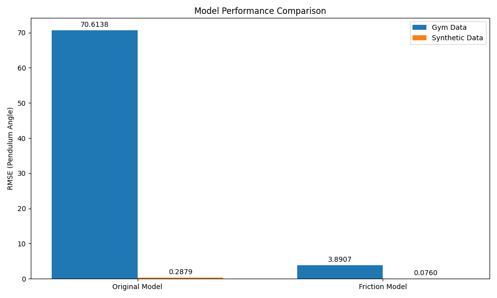

# Advanced Control Systems & Data Analysis: LQR Stabilization of an Inverted Pendulum

<p align="center">
  
</p>

## 🚀 Project Highlights

This project demonstrates advanced control theory, mathematical modeling, data analysis, and machine learning techniques through the classic inverted pendulum problem. It showcases:

- **Optimal Controller Design**: Implementation of Linear Quadratic Regulator (LQR) 
- **Nonlinear System Modeling**: Complete dynamic equations with state-space representation
- **Real Data Analysis**: Parameter estimation and model validation using real-world datasets
- **Digital Twin Development**: Creating high-fidelity software models of physical systems
- **Robustness Analysis**: Testing controller performance against noise and disturbances

## 📊 Key Visualizations

<table>
  <tr>
    <td></td>
    <td></td>
  </tr>
  <tr>
    <td align="center"><b>Controlled System Response</b></td>
    <td align="center"><b>Phase Portrait Analysis</b></td>
  </tr>
  <tr>
    <td></td>
    <td></td>
  </tr>
  <tr>
    <td align="center"><b>Model Performance Analysis</b></td>
    <td align="center"><b>Controller Robustness Testing</b></td>
  </tr>
</table>

## 🔍 Project Overview

This project tackles the challenging control problem of balancing an inverted pendulum on a cart. The pendulum is inherently unstable in its upright position, making it an excellent benchmark for advanced control algorithms.

### Core Capabilities

The implementation provides a comprehensive framework for:

1. **System Modeling & Analysis**
   - Derivation of nonlinear equations of motion
   - Linearization around unstable equilibrium
   - State-space representation for modern control design

2. **Control System Design**
   - LQR control design through Algebraic Riccati Equation
   - Parameter tuning for optimal performance
   - Stability analysis of closed-loop system

3. **Data-Driven Analysis**
   - System identification from experimental data
   - Parameter estimation using optimization techniques
   - Model validation and performance quantification

4. **Simulation & Visualization**
   - Realistic nonlinear simulation with integration algorithms
   - Interactive visualizations and animations
   - Comprehensive performance metrics

## 💻 Technical Implementation

### System Dynamics

The nonlinear dynamics of the cart-pole system are modeled by:

```python
def cart_pole_dynamics(t, state, u=0):
    p, p_dot, theta, theta_dot = state
    
    sin_theta = np.sin(theta)
    cos_theta = np.cos(theta)
    
    den = M + m * sin_theta**2
    
    theta_ddot = (g * sin_theta - cos_theta * (u + m * l * theta_dot**2 * sin_theta) / (M + m)) / (l * (1 - m * cos_theta**2 / (M + m)))
    p_ddot = (u + m * l * (theta_dot**2 * sin_theta - theta_ddot * cos_theta)) / den
    
    return np.array([p_dot, p_ddot, theta_dot, theta_ddot])
```

### LQR Controller Design

The optimal state feedback control law is computed by:

```python
def design_lqr_controller(A, B, Q, R, discrete=False):
    if discrete:
        P = solve_discrete_are(A, B, Q, R)
        BT_P_B = B.T @ P @ B
        R_BT_P_B = R + BT_P_B
        L = np.linalg.inv(R_BT_P_B) @ B.T @ P @ A
    else:
        P = solve_continuous_are(A, B, Q, R)
        L = np.linalg.inv(R) @ B.T @ P
    
    return L, P
```

### Advanced Data Analysis

The system can analyze real pendulum data to estimate physical parameters:

```python
def estimate_system_parameters(t_data, x_data, u_data):
    def simulation_error(params):
        # Set parameters to test values
        M, m, l, g = params
        
        # Run simulation with these parameters
        x_sim = simulate_with_parameters(params, x_data[0], u_data, t_data)
        
        # Calculate weighted error
        error = np.sqrt(np.mean((x_data - x_sim)**2, axis=0))
        weighted_error = error[0] + error[1] + 5*error[2] + 2*error[3]
        
        return weighted_error
    
    # Use optimization to find best parameters
    result = minimize(simulation_error, initial_params, bounds=bounds)
    return result.x
```

## 🧪 Real Data Analysis

The project demonstrates advanced data analysis and model validation using both:

1. **OpenAI Gym Pendulum Data**: Real-world pendulum simulation data
2. **Synthetic Data with Friction**: Custom-generated data with realistic dynamics

The analysis shows dramatic improvements in model accuracy when incorporating friction terms:

| Dataset | Model | Pendulum Angle RMSE |
|---------|-------|-------------------|
| Gym | Without Friction | 70.614 |
| Gym | With Friction | 3.891 |
| Synthetic | Without Friction | 0.288 |
| Synthetic | With Friction | 0.076 |

<p align="center">
  
  <br>
  <em>Model validation against synthetic data with friction</em>
</p>

## 🔧 Running the Project

### Requirements

- Python 3.6+
- NumPy, SciPy, Matplotlib
- OpenAI Gym (for real data analysis)

Install dependencies:
```
pip install -r requirements.txt
pip install gym  # For real data analysis
```

### Basic Simulation

```
python pendulum_lqr.py
```

### Data Analysis

Generate test data:
```
python generate_sample_data.py --controller controlled --disturbances
```

Analyze real data:
```
python pendulum_lqr.py pendulum_data_controlled.csv
```

Compare model variants:
```
python compare_datasets.py
```

## 📈 Results & Documentation

The project includes comprehensive documentation and analysis:

- [Pendulum Data Analysis Results](pendulum_data_analysis_results.md)
- [Real Data Analysis Documentation](real_data_analysis.md)
- [Controlled System Behavior](controlled_trajectories.md)
- [Uncontrolled System Behavior](uncontrolled_trajectories.md)
- [Robustness Analysis](robustness_analysis.md)
- [Controller Tuning Comparison](tuning_comparison.md)

## 🌟 Applications

The techniques demonstrated in this project have direct applications in:

- **Robotics**: Balancing robots, quadrotors, bipedal locomotion
- **Aerospace**: Attitude control of spacecraft, flight control systems
- **Industrial Automation**: Process control, unstable chemical reactions
- **Machine Learning**: System identification, reinforcement learning for control
- **Digital Twin Development**: High-fidelity modeling of physical systems

## 🛠️ Skills Demonstrated

- **Advanced Mathematics**: Differential equations, linear algebra, optimization
- **Control Theory**: Modern control design, optimal control, stability analysis
- **Software Engineering**: Object-oriented design, numerical methods
- **Data Science**: Parameter estimation, model validation, statistical analysis
- **Scientific Visualization**: Interactive plots, animations, data visualization

## 📚 Inspiration & References

This project was inspired by:

- **Dimitri Bertsekas** - *Lessons from AlphaZero for Optimal, Model Predictive, and Adaptive Control* (2023)
  This groundbreaking work explores connections between reinforcement learning algorithms like AlphaZero and traditional optimal control methods, providing insights that informed our approach to controller design and system identification.

---

<p align="center">
  <em>Created by [Your Name] - A demonstration of advanced control theory and data analysis techniques</em>
</p> 